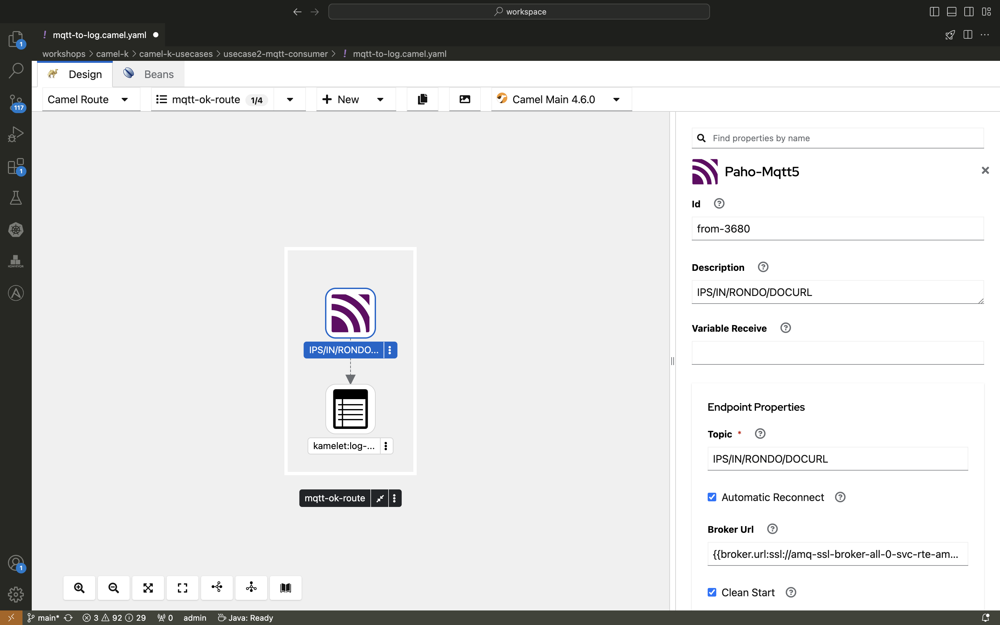

+++
title = 'Camel K PoC 1/4: MQTT Receiver to Logs'
date = 2024-08-01
draft = true
+++

# Camel K Proof of Concept Series

I am currently taking part in a proof of concept for Camel K (the kubernetes deployment solution of the Quarkus-based integration solution Camel) and have had some experiences that I would like to share in four blog posts describing partial solutions.

The basic version of the source code was created by my dear colleague Jean Nyilimbibi and [published it open source here: https://bitbucket.org/jnyilimbibi/camel-k-usecases](https://bitbucket.org/jnyilimbibi/camel-k-usecases)

I forked his git repository and restructured it so that all non-Camel-K solution software is managed in a helm chart. 

This separates the environment creation (with all of the needed instances such as a database or a minio instance)
to make it clear how easy it is to create complex solutions in Camel K: https://bitbucket.org/gpmodz/camel-k-usecases

In general, the solutions were created using Kaoto (https://kaoto.io/), a no-code solution that allows you to simply click your integrations via a graphical user interface.

## MQTT Receiver to Logs

In this first blog post, I will share my experience with setting up a Camel K route that listens to an MQTT topic and logs the incoming messages.

### Infrastructure Setup

For this use case, the infrastructure is fairly straightforward:

- An **AMQ Broker** is deployed on a Kubernetes cluster.
- Access credentials are stored securely in a Kubernetes Secret within the relevant namespace.

As always, everything is included in the helm chart which can be found in the infrastructure folder. The AMQ Broker and its secret is located [in the infrastructure/templates/AmqBroker folder](https://bitbucket.org/gpmodz/camel-k-usecases/src/main/infrastructure/templates/AmqBroker/).

### The Solution

The goal here is simple: to capture messages from an MQTT topic and log them. Here’s how I achieved this with Kaoto and Camel K:

1. **Use the paho-mqtt5 kamelet**\
The route listens to a specific topic on the MQTT broker.
1. **Create a logger**\
As soon as a message arrives, it is picked up and logged.

And here's how it really looks like in kaoto:



The code can be found [in the usecase2-mqtt-consumer folder](https://bitbucket.org/gpmodz/camel-k-usecases/src/main/usecase2-mqtt-consumer/) which also includes a deploy shell script. The shell script deploy the camel k integration with several parameters and configurations such as tracing or the includes of the credential secrets for the AMQ Broker.

Here is a simplified version of the Camel K route:

```java
from("paho-mqtt5:{{mqtt.topic}}?brokerUrl={{mqtt.brokerUrl}}")
    .log("Received message: ${body}");
```


This route is defined in a Camel K integration, leveraging Camel's paho-mqtt5 component to interact with the MQTT broker.

### Why Camel K?
The true beauty of Camel K lies in its seamless integration with Kubernetes. By managing the non-Camel K components using Helm charts, I demonstrated how easy it is to set up and manage complex integration solutions. The use of Camel K reduces boilerplate code and infrastructure management overhead, allowing you to focus on the business logic.

### Conclusion
This simple yet effective use case illustrates the potential of Camel K in handling real-time data integration. Whether you're just starting with Camel K or looking to expand your integration capabilities, this example shows how easily you can implement an MQTT receiver with minimal configuration.

Stay tuned for the next post where we'll dive into reading from a PostgreSQL database and writing to an MQTT topic!
