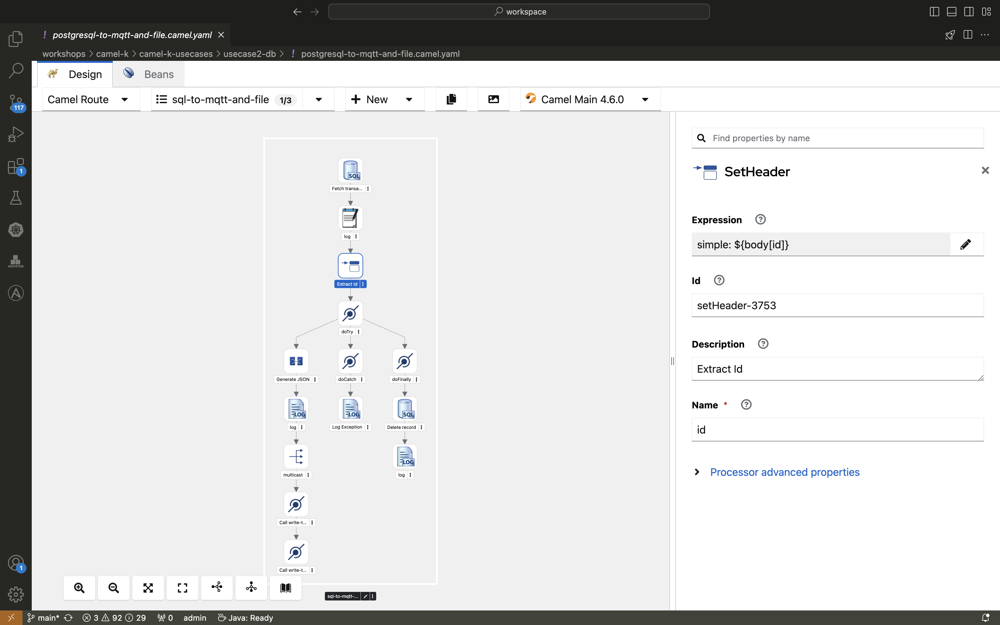

+++
title = 'Camel K PoC 2/4: Reading from PostgreSQL and Writing to MQTT'
date = 2024-08-02
draft = true
+++

## Reading from PostgreSQL and Writing to MQTT

Continuing with our exploration of Camel K, today's blog post will focus on a more advanced use case: reading entries from a PostgreSQL database, converting them to JSON, and writing them to an MQTT topic.

### Infrastructure Setup

This setup builds on the previous infrastructure with additional components:

- **PostgreSQL Database**: Credentials are securely stored in a Kubernetes Secret.
- **AMQ Broker**: Deployed on the Kubernetes cluster, with access credentials stored in a Secret.

### The Solution

The goal is to read entries from a PostgreSQL database, transform the data into JSON format, and publish the data to an MQTT topic. Additionally, processed entries are deleted from the database to prevent reprocessing.

1. **Camel K Route**:
   - The route queries the database for new entries.
   - It then converts the result set into JSON.
   - Finally, it publishes the JSON data to the MQTT topic.

Here’s how the Camel K route looks:
```java
from("sql:select * from orders where processed = false?dataSource=dataSource")
    .marshal().json()
    .to("paho-mqtt5:{{mqtt.topic}}?brokerUrl={{mqtt.brokerUrl}}")
    .log("Processed and sent to MQTT: ${body}")
    .to("sql:update orders set processed = true where id = :#id?dataSource=dataSource");
```

And here's how it really looks like in kaoto:



2. **Cronjob Integration:**

  - To simulate a continuous flow of data, I integrated a Go application (fill-db) that generates random entries and inserts them into the PostgreSQL database.
  - This application runs as a Kubernetes cronjob, triggering every minute.

## Why Camel K?

Camel K simplifies complex integrations by allowing you to focus on the logic rather than the infrastructure. Using Kaoto, a no-code solution, the integration was easily built by simply clicking together the components. The modularity and flexibility provided by Camel K make it an excellent choice for scenarios like this.

## Conclusion

This use case showcases how Camel K can handle complex integrations involving databases and message brokers, with minimal overhead. If you're working with microservices and need a reliable integration framework, Camel K is worth exploring.
In the next post, we'll look at how to read XML files from an S3 bucket and send the data to an MQTT topic.
