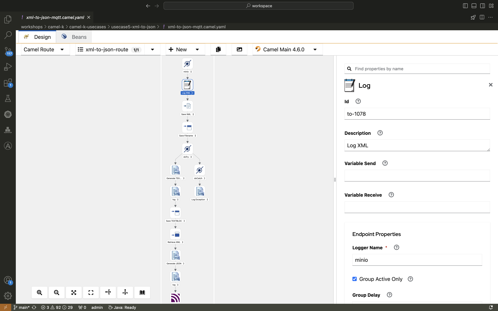

+++
title = 'Camel K PoC 3/4: Reading from PostgreSQL and Writing to MQTT'
date = 2024-08-05
draft = true
+++

## Reading XML from S3 and Writing to MQTT

In today's post, we’ll explore another powerful use case of Camel K: reading XML files from an S3 bucket, converting them to JSON, and publishing the data to an MQTT topic. This builds on our previous work with Camel K and demonstrates its versatility in handling various data formats and sources.

### Infrastructure Setup

The infrastructure for this use case involves:

- **Minio Instance**: Acting as the S3 bucket provider, with access credentials stored in a Kubernetes Secret.
- **AMQ Broker**: As in previous examples, credentials are stored in a Secret.

### The Solution

Here’s how the solution works:

1. **Camel K Route**:
   - The route periodically checks the S3 bucket for new XML files.
   - It reads the XML file, converts the content to JSON, and sends the JSON data to an MQTT topic.
   - After successful processing, the XML file is deleted from the S3 bucket.

Here’s the basic structure of the route:

```java
from("aws2-s3://{{bucket.name}}?accessKey=RAW({{s3.accessKey}})&secretKey=RAW({{s3.secretKey}})&region={{s3.region}}")
    .unmarshal().jacksonxml()
    .marshal().json()
    .to("paho-mqtt5:{{mqtt.topic}}?brokerUrl={{mqtt.brokerUrl}}")
    .log("Processed file from S3 and sent to MQTT: ${body}")
    .to("aws2-s3://{{bucket.name}}?operation=deleteObject&key=${header.CamelAwsS3Key}");
```

And here's how it really looks like in kaoto:



2. **Cronjob Integration:**

A Go application (fill-bucket) uploads sample XML files to the S3 bucket every minute. This application runs as a Kubernetes cronjob to simulate a continuous flow of data for processing.

## Why Camel K?

This use case illustrates Camel K's strength in integrating various data sources and formats, making it a perfect fit for modern, cloud-native architectures. The ease of handling different protocols and formats in a single integration flow is a testament to Camel K's flexibility and power.

## Conclusion

Camel K makes it incredibly easy to set up complex data flows involving cloud storage and message brokers. By automating tasks such as reading from S3 and publishing to MQTT, you can create scalable, efficient data pipelines with minimal effort.

In the next post, we’ll explore a similar scenario, this time with CSV files.
