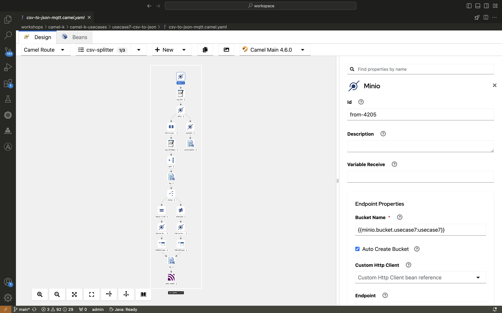

+++
title = 'Camel K PoC 4/4: Reading CSV from S3 and Writing to MQTT'
date = 2024-08-06
draft = true
+++

## Reading CSV from S3 and Writing to MQTT

For the final blog post in this series, we'll examine how Camel K can be used to read CSV files from an S3 bucket, convert the data to JSON, and send it to an MQTT topic. This builds on the concepts covered in the previous posts and further demonstrates Camel K’s flexibility.

### Infrastructure Setup

Similar to the previous post, the infrastructure includes:

- **Minio Instance**: Providing S3 bucket functionality, with access credentials managed in a Kubernetes Secret.
- **AMQ Broker**: Already set up, with credentials stored in a Secret.

### The Solution

This use case involves a straightforward Camel K route:

1. **Camel K Route**:
   - The route monitors the S3 bucket for new CSV files.
   - Upon detecting a new file, it reads the CSV content, converts it to JSON, and sends it to the MQTT topic.
   - After successful processing, the CSV file is deleted from the S3 bucket.

Here’s an example of the route:

```java
from("aws2-s3://{{bucket.name}}?accessKey=RAW({{s3.accessKey}})&secretKey=RAW({{s3.secretKey}})&region={{s3.region}}")
    .unmarshal().csv()
    .marshal().json()
    .to("paho-mqtt5:{{mqtt.topic}}?brokerUrl={{mqtt.brokerUrl}}")
    .log("Processed CSV file from S3 and sent to MQTT: ${body}")
    .to("aws2-s3://{{bucket.name}}?operation=deleteObject&key=${header.CamelAwsS3Key}");
```
2. Cronjob Integration:
    - The same fill-bucket Go application from the previous use case is used to upload CSV files to the S3 bucket every minute, ensuring a steady stream of data for the Camel K route to process.


And here's how it really looks like in kaoto:



## Why Camel K?
Camel K's ability to handle diverse data formats like CSV and integrate them seamlessly into a broader data processing pipeline is a significant advantage. This use case, along with the previous ones, highlights Camel K's role as a versatile integration framework that simplifies complex workflows.

## Conclusion
With Camel K, setting up and managing integrations involving various data formats and sources becomes a streamlined process. The examples shared in this series illustrate how you can leverage Camel K to create robust, scalable solutions with minimal effort.

I hope these posts have provided you with valuable insights into the capabilities of Camel K.