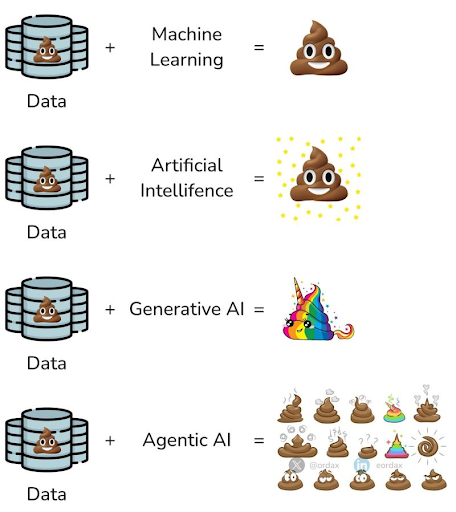

+++
title = 'News - CW11 - Agentic AI & MCP'
date = 2025-03-14T16:25:35+01:00
draft = false
+++

# CW11

## Agentic AI & MCP

So that week I was in munich and worked with a colleague on the topics Agentic AI and MCP. Mostly we did research and didn't create own things. Goal was to gain so much knowledge in that topics to be able to talk with people about that.

I will publish an article when I'm ready and had the time to pipeline my thoughts, but here's a short journey through these topics:

### Agentic AI - Why? What's that?

The term Agentic AI (or more precisely: agentic systems) was invented by a company called anthropic, and roughly describes tooling around an LLM that allows validation of results but also further enrichment and many other modifications to be added to the processes [^1].

This is particularly interesting in highly regulated environments such as public law institutions or the financial sector. 

This is particularly interesting in highly regulated environments such as public institutions or the financial sector, where it gives them leverage to implement IT governance. 

Two of my favorite memes that shows the motivation behind the whole thing is this one (with big thanks to my colleague Mario Fusco):

### Two things enable us to do this at all.

One is the ability to add further tooling to an LLM. This is where the power of vLLM comes into play, which on the one hand allows optimized serving, but on the other hand has a property for served LLMs called *--enable-auto-tool-choice*. Many LLMs can do this by default, the command may just be called differently. 

The second core aspect that makes the whole thing possible is Model Context Protocol (MCP), a kind of quasi-standard interface for LLMs to use other things. This allows you to call your own software from LLMs. 

For example, you have an email controller in your Quarkus app that can be used to send emails automatically. This controller can be provided with an annotation and written in natural language so that emails can be sent with it. This controller can be linked to an LLM via MCP so that a call to the LLM with “... and send the result by email to ...@redhat.com” uses this controller.

All in all I must admit these we live in super interesting times. There is so much going on in our field and much more to come. Even long-established companies are looking into these issues and positioning themselves, see ChatGPT [^3]. 

[^1]: https://www.anthropic.com/engineering/building-effective-agents
[^2]: https://ai-on-openshift.io/odh-rhoai/enable-function-calling/#how-to-enable-function-calling-with-vllm-in-openshift-ai
[^3]: https://openai.com/index/new-tools-for-building-agents/